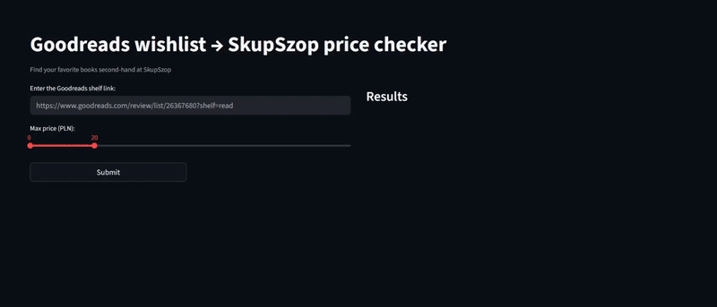

# Books Wishlist Price Checker

<div align="center">


</div>

## Description

An automation app that scrapes your bookshelf from [Goodreads.com](https://www.goodreads.com/) and checks the prices of second-hand books on [SkupSzop.pl](https://skupszop.pl/).
 

This project was created to solve (my) everyday problem:  
instead of manually searching through dozens of books during SkupSzop's daily new arrivals, the app automatically takes a Goodreads shelf ([example](https://www.goodreads.com/review/list/149269739-ola?shelf=to-buy)) and finds which books are available below a user-defined price threshold.

It saves time and makes it easier to spot good deals without browsing the store manually every day.

## Disclaimer!

This project is intended for **educational purposes only**.  
Using this scraper on Goodreads or SkupSzop for commercial purposes or in violation of their terms of service is **not allowed**.

## How It Works

1. **Input**: Provide a Goodreads shelf URL (e.g., wishlist, to-read, etc.) - [example](https://www.goodreads.com/review/list/149269739-ola?shelf=to-buy)
2. **Scraping**: The app extracts book titles and authors from your Goodreads shelf
3. **Searching**: Each book is searched on SkupSzop.pl within your specified price range
4. **Matching**: Uses similarity algorithms to match books despite variations in titles, subtitles, or author formatting
5. **Results**: Display matching books with prices, conditions, and direct links




## Installation

### Prerequisites
- Python 3.8+
- pip package manager

### Step-by-Step Setup

#### 1. **Clone the repository**
```bash
git clone https://github.com/sq7alx/books-wishlist-price-checker.git
cd books-wishlist-price-checker
```

#### 2. **Create virtual environment (recommended)**
```bash
python -m venv venv
source venv/bin/activate  # On Windows: venv\Scripts\activate
```

#### 3. **Install Python dependencies**
```bash
pip install -r requirements.txt
```

#### 4. **Running the Streamlit App**
```bash
streamlit run streamlit_app.py
```

### Using the App
1. Open your browser and navigate to the local Streamlit URL (usually `http://localhost:8501`)
2. Enter your Goodreads shelf URL in the input field
3. Set your desired price range using the slider
4. Click "Submit" to start the process
5. Monitor the progress and view results in real-time
6. Click on "Page" links to visit the book pages on SkupSzop

### Dependencies
- `requests==2.32` - HTTP requests for Goodreads scraping
- `beautifulsoup4==4.13` - HTML parsing
- `playwright==1.55` - Browser automation for SkupSzop
- `pandas==2.3.2` - Data manipulation
- `streamlit==1.49.1` - Web interface

### Example Goodreads URLs
- `https://www.goodreads.com/review/list/USER_ID?shelf=to-read`
- `https://www.goodreads.com/review/list/USER_ID?shelf=wishlist`
- `https://www.goodreads.com/review/list/USER_ID-USERNAME?shelf=SHELF_NAME`


## Key Components

### Goodreads Scraper (`goodreads_scraper.py`)
- Handles pagination through multiple shelf pages
- Extracts book titles and removes series information
- Implements rate limiting and error handling
- Supports various Goodreads shelf layouts

### SkupSzop Search (`skupszop_search.py`)
- Uses Playwright for dynamic content scraping
- Implements fuzzy matching for book titles and authors
- Filters results by price range and condition
- Handles cookie acceptance and timeouts

### Async Version (`skupszop_search_async.py`)
- Concurrent processing for faster execution
- Semaphore-controlled parallel requests
- Improved performance for large book collections

### Customization
You can modify thresholds and settings in the respective Python files:
- `AUTHOR_MATCH_THRESHOLD` in `skupszop_search.py`
- `TITLE_SIMILARITY_THRESHOLD` in `skupszop_search.py`
- Delay and timeout values in scraping functions


## Future Enhancements

- [ ] Support for multiple bookstore websites
- [ ] Email notifications for new matches
- [ ] Price history tracking


## License

This project is for educational purposes only. Please respect the terms of service of Goodreads and SkupSzop when using this tool.
</br>
</br>

 Happy book hunting! :]